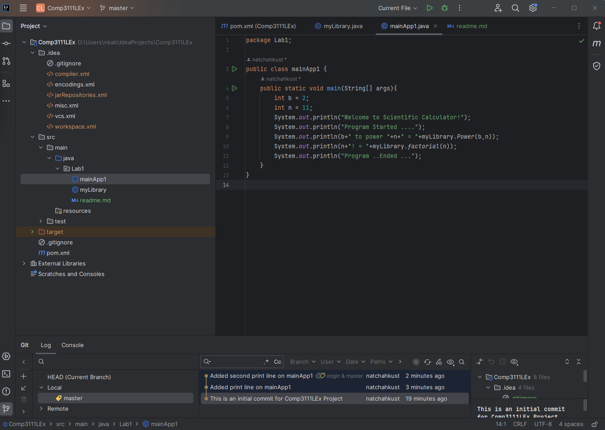

This is my first lab in Comp3111 - Software Engineering

1. I have learnt the way to build a Java Project in intelliJ;
2. I have successfully created my first Github to share project source with others;

Here is a screenshot of my 1st lab project in intelliJ; 

